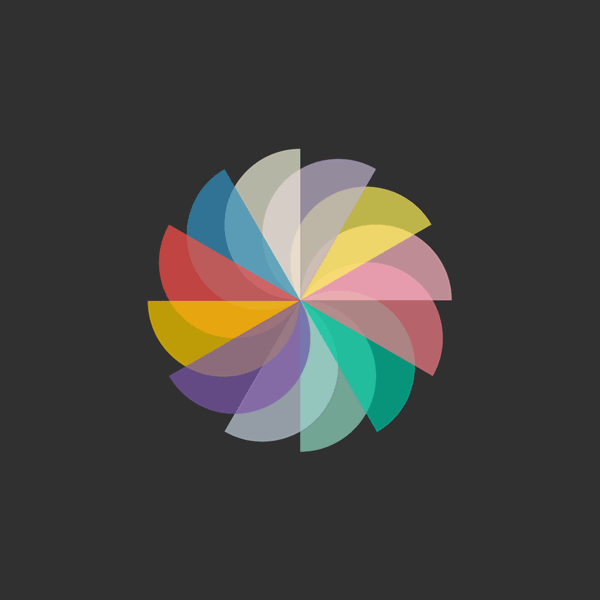

# tgon2993_9103_tut6_Creative_coding_major_project
## Individual  Task

### Instructions for interacting with the work
1. After loading the page, you can see a blue background with cyan border;
2. Move the mouse over the canvas and click to start the animation: each graphic element will appear in turn;
3. After all the elements appear, the circle will start rotating animation;

### Details about individual animation code
**Which did you choose to drive your individual code**
I chose: "Time-Based:Employ timers and events for animation.".

**Which properties of the image will be animated and how？**
Click Start: When the user clicks on the canvas, the animation begins
Appear one by one: After the animation begins, the graphic elements are displayed one by one in the order set;
Rotation animation: After all the elements are displayed, let the round element begin to rotate automatically;

#### Animation inspiration
My animation was inspired by the following animated image from pinterest. I was inspired by its dynamic effect of repeatedly zooming in and out and rotating effects. In this way, I added some simple rotation animations and gradual animation effects.

#### Technical specification
In this animation, I use the setInterval function to control the order in which each element appears, and make the round element start rotating after all the elements appear. The specific implementation is as follows:

First, in the setup function, I used createCanvas to create a canvas the same size as the browser window and added a click-event listener to trigger the animation.

Second, I used the windowResized function, which calls resizeCanvas to resize the canvas when the browser window size changes, to help the graphic elements adapt to the new window size.

Third, I recalculated the diameter value based on the window width and height to ensure that the graph remains properly proportioned and positioned when the window size changes.

Finally, I used the setInterval function to display graphic elements every 500 milliseconds until all the elements were displayed, and then began rotating animation of the round elements. The rotationEnabled flag variable controls rotation. In order to achieve this function, I re-adjusted and rearranged the code of drawing graphs in the team code.

### Reference
🎧 WORTH TO WATCH & LISTEN … FLASHBACK 🎧 (april 2021) 🎙🎬. (2021, May 12). https://dvandmb.wordpress.com/2021/05/12/worth-to-watch-and-listen-flashback-april-2021/
